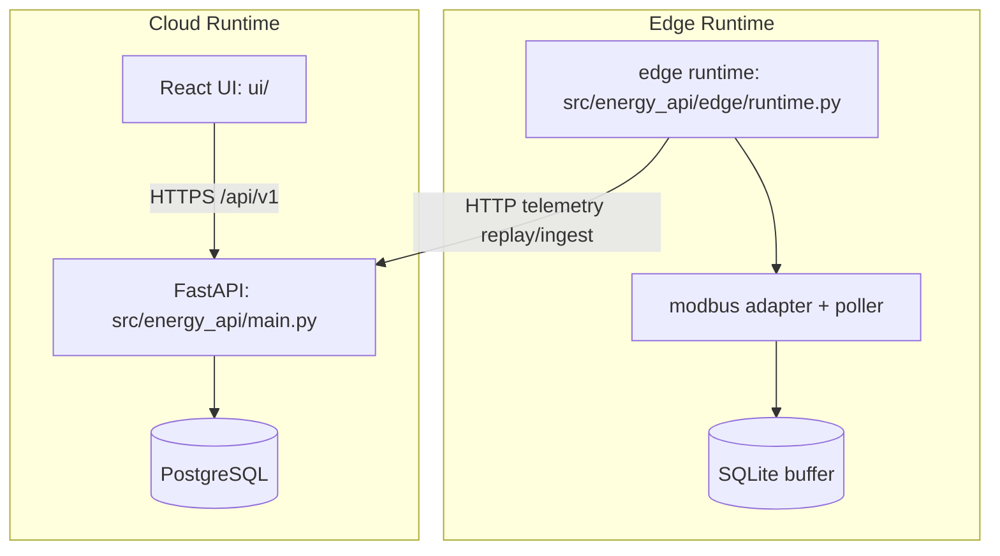

<!-- /Users/loan/Desktop/energyallocation/docs/ARCHITECTURE.md -->
# Architecture

## Data flow (implemented)
1. Telemetry ingestion endpoint receives points: `src/energy_api/routers/control_loop.py::ingest_telemetry`.
2. Stream IDs resolved by `src/energy_api/control/repository.py::resolve_stream_ids`.
3. Points inserted with dedupe on `(stream_id, ts)` by `insert_telemetry_points`.
4. Site state built by `src/energy_api/control/state_engine.py::StateEngine.build_site_state`.
5. Rule decision generated by `src/energy_api/control/rule_engine.py::RuleEngine.evaluate`.
6. Command queued/sent/failed by `src/energy_api/control/dispatcher.py::CommandDispatcher.dispatch`.
7. Run record persisted by `create_optimization_run` and savings by `SavingsService.compute_summary`.

## Control loop (implemented)
- Trigger path: `POST /api/v1/sites/{site_id}/optimize/run`.
- Decision path: state engine -> rule engine -> dispatcher.
- Logging path: `optimization_runs`, `commands`, `savings_snapshots` tables.

## Failure modes and fallback behavior (implemented)
- Missing telemetry streams: ingest returns `400` with `missing_streams`.
- Stale/missing critical telemetry: `online=False`, rule engine enters safe mode (`idle`).
- Pending unacknowledged command: dispatcher blocks new command.
- Dispatch retries exhausted: command status set `failed` with `failure_reason`.

## Failure modes and fallback behavior (not implemented)
- MQTT broker publish/ack loop for edge transport: NOT IMPLEMENTED.
- Edge-to-cloud command pull/ack API integration: PARTIAL (edge local command queue + reconciliation implemented, cloud-side pull workflow still pending).

## Edge runtime (implemented)
- Modbus adapter: `src/energy_api/edge/modbus_adapter.py`
- Decoder + staleness + poller: `src/energy_api/edge/decoder.py`, `src/energy_api/edge/staleness.py`, `src/energy_api/edge/poller.py`
- Durable buffer + replay: `src/energy_api/edge/storage/sqlite.py`, `src/energy_api/edge/replay.py`
- Startup recovery + safety + observability: `src/energy_api/edge/runtime.py`, `src/energy_api/edge/commands.py`, `src/energy_api/edge/observability.py`
- Fault-injection simulator: `src/energy_api/edge/simulation/modbus_server.py`

## Deployment topology (current)
- API container: `Dockerfile`, service `api` in `docker-compose.yml`.
- Postgres container: service `postgres` with SQL init from `db/migrations/`.
- UI container: service `ui` serving Vite dev server.
- Separate edge Docker container/process wiring: NOT YET ADDED TO `docker-compose.yml`.
