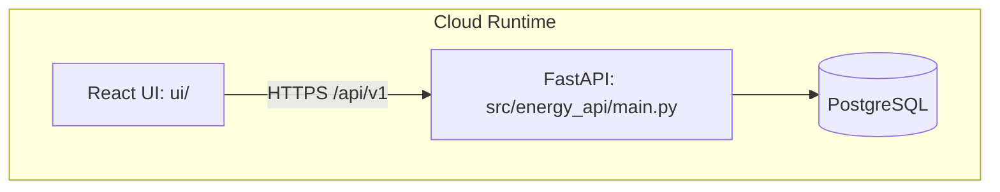

<!-- /Users/loan/Desktop/energyallocation/docs/ARCHITECTURE.md -->
# Architecture

## Data flow (implemented)
1. Telemetry ingestion endpoint receives points: `src/energy_api/routers/control_loop.py::ingest_telemetry`.
2. Stream IDs resolved by `src/energy_api/control/repository.py::resolve_stream_ids`.
3. Points inserted with dedupe on `(stream_id, ts)` by `insert_telemetry_points`.
4. Site state built by `src/energy_api/control/state_engine.py::StateEngine.build_site_state`.
5. Rule decision generated by `src/energy_api/control/rule_engine.py::RuleEngine.evaluate`.
6. Command queued/sent/failed by `src/energy_api/control/dispatcher.py::CommandDispatcher.dispatch`.
7. Run record persisted by `create_optimization_run` and savings by `SavingsService.compute_summary`.

## Control loop (implemented)
- Trigger path: `POST /api/v1/sites/{site_id}/optimize/run`.
- Decision path: state engine -> rule engine -> dispatcher.
- Logging path: `optimization_runs`, `commands`, `savings_snapshots` tables.

## Failure modes and fallback behavior (implemented)
- Missing telemetry streams: ingest returns `400` with `missing_streams`.
- Stale/missing critical telemetry: `online=False`, rule engine enters safe mode (`idle`).
- Pending unacknowledged command: dispatcher blocks new command.
- Dispatch retries exhausted: command status set `failed` with `failure_reason`.
- Edge replay retry path applies exponential backoff via edge replay/storage services.
- Edge command processing supports deduplication and unresolved-command safety gating.

## Failure modes and fallback behavior (remaining gaps)
- Edge modules are implemented in `src/energy_api/edge/`, but the API service does not yet run an always-on edge runtime loop by default.
- MQTT broker publish/ack loop remains a production blocker when MQTT transport is required.
- Operational hardening is pending: long-run supervision, field runbooks, and soak-test evidence.

## Deployment topology (current)
- API container: `Dockerfile`, service `api` in `docker-compose.yml`.
- Postgres container: service `postgres` with SQL init from `db/migrations/`.
- UI container: service `ui` serving Vite dev server.

## Edge runtime implementation status (March 2026)
- Implemented modules: `modbus_adapter`, `decoder`, `poller`, `staleness`, `replay`, `commands`, `runtime`, and SQLite-backed storage in `src/energy_api/edge/`.
- Edge runtime behavior is currently validated primarily through `tests/edge/` and `scripts/edge_poll_demo.py`.
- Separate edge process/container deployment path is not yet fully operationalized.
